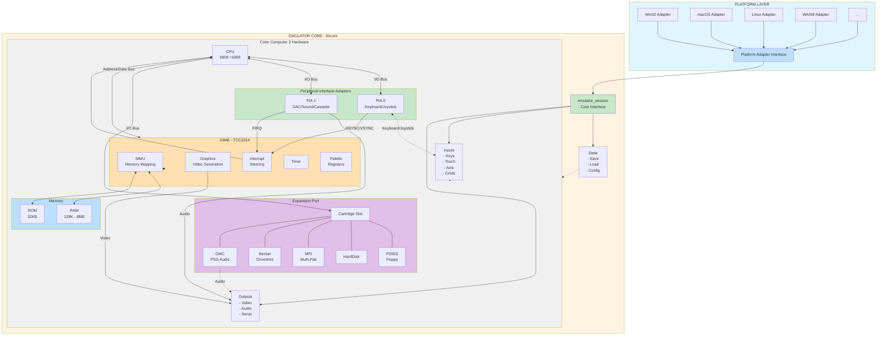

# Cross-Platform Architecture for VCC Emulator

## Overview

This document defines a platform-agnostic interaction boundary for the VCC (Virtual Color Computer) emulator. The goal is to separate the pure emulation logic from any platform-specific concerns, enabling the emulator to run on:

- Desktop (Windows, macOS, Linux)
- Mobile (iOS, Android)
- Web (WASM)
- VR/AR headsets
- Wearables
- Embedded systems
- Cloud/streaming services
- CLI/headless environments

## Core Principle

> **An emulator is fundamentally a state machine with I/O.**

The interaction boundary should reflect this reality, not assume any particular UI paradigm. There are no menus, windows, dialogs, or file paths at the core level.

---

## Architecture Diagram



---

## Core Types

### Input Events

Input events represent any form of user interaction, abstracted away from the physical input device.

```cpp
namespace vcc::core
{
    /// Abstract input event - no assumption about source
    /// Could originate from keyboard, touch, controller, motion tracking, etc.
    struct input_event
    {
        enum class type : uint8_t
        {
            key_down,       // Discrete key/button press
            key_up,         // Discrete key/button release
            pointer_down,   // Touch/mouse begin
            pointer_up,     // Touch/mouse end
            pointer_move,   // Touch/mouse movement
            axis            // Analog axis (joystick, trigger, accelerometer)
        };

        type event_type;
        uint32_t code;      // Platform-neutral key/button code (see key_codes.h)
        uint8_t pointer_id; // For multi-touch support
        float x;            // Normalized 0.0-1.0 for pointer/axis X
        float y;            // Normalized 0.0-1.0 for pointer/axis Y
        float pressure;     // For pressure-sensitive input (0.0-1.0)
        uint64_t timestamp; // Nanoseconds since session start
    };
}
```

### Commands

Commands represent discrete actions that can be triggered from any source (menu, voice, gesture, CLI, network, automation script, etc.).

```cpp
namespace vcc::core
{
    /// A command parameter value
    using command_param = std::variant<
        std::monostate,             // No value / flag
        bool,                       // Boolean
        int64_t,                    // Integer
        double,                     // Floating point
        std::string,                // Text
        std::vector<uint8_t>        // Binary data
    >;

    /// Commands are discrete actions with optional parameters
    struct command
    {
        std::string name;
        std::map<std::string, command_param> parameters;
    };

    /// Describes an available command (for UI discovery)
    struct command_descriptor
    {
        std::string name;
        std::string description;
        std::string category;       // Grouping hint (not a menu!)

        struct parameter_info
        {
            std::string name;
            std::string description;
            std::string type;       // "bool", "int", "float", "string", "bytes"
            bool required;
            command_param default_value;
        };

        std::vector<parameter_info> parameters;
    };
}
```

### Standard Commands

The emulator core defines these standard commands:

| Command | Parameters | Description |
|---------|------------|-------------|
| `reset` | `type`: "soft" \| "hard" | Reset the machine |
| `pause` | | Pause emulation |
| `resume` | | Resume emulation |
| `insert_media` | `slot`: string, `data`: bytes | Insert disk/cartridge |
| `eject_media` | `slot`: string | Eject media from slot |
| `save_state` | `slot`: int (optional) | Save machine state |
| `load_state` | `slot`: int (optional) | Load machine state |
| `set_speed` | `multiplier`: float | Set emulation speed |
| `configure` | `key`: string, `value`: variant | Change configuration |
| `query` | `property`: string | Query emulator state |

Expansion modules (cartridges/paks) can register additional commands.

---

## Output Types

### Video Output

```cpp
namespace vcc::core
{
    /// Pixel format enumeration
    enum class pixel_format : uint8_t
    {
        rgba8888,       // 32-bit RGBA (most compatible)
        bgra8888,       // 32-bit BGRA (Windows native)
        rgb565,         // 16-bit RGB (mobile-friendly)
        palette8        // 8-bit indexed (with palette)
    };

    /// Video frame output - just raw pixels, no window concepts
    struct video_frame
    {
        std::span<const uint8_t> pixels;    // Raw pixel data
        pixel_format format;
        uint32_t width;                     // Actual pixel width
        uint32_t height;                    // Actual pixel height
        uint32_t stride;                    // Bytes per row (for alignment)
        uint32_t display_aspect_num;        // Display aspect ratio numerator
        uint32_t display_aspect_den;        // Display aspect ratio denominator
        uint64_t frame_number;              // Sequential frame counter

        // Optional palette for indexed modes
        std::span<const uint32_t> palette;  // Up to 256 RGBA entries
    };
}
```

### Audio Output

```cpp
namespace vcc::core
{
    /// Audio buffer output - just samples, no device concepts
    struct audio_buffer
    {
        std::span<const float> samples;     // Interleaved stereo (-1.0 to 1.0)
        uint32_t sample_rate;               // Samples per second
        uint8_t channels;                   // 1 = mono, 2 = stereo
        uint64_t timestamp;                 // Nanoseconds since session start
    };
}
```

---

## Machine Configuration

Configuration uses a flat key-value model with namespaced keys. No file paths - just values.

```cpp
namespace vcc::core
{
    /// Configuration value types
    using config_value = std::variant<
        bool,
        int64_t,
        double,
        std::string,
        std::vector<uint8_t>
    >;

    /// Machine configuration
    struct machine_config
    {
        std::string machine_type;           // "coco3", "coco2", "coco1"
        std::map<std::string, config_value> settings;
    };
}
```

### Standard Configuration Keys

| Key | Type | Description |
|-----|------|-------------|
| `cpu.type` | string | CPU variant ("6809", "6309") |
| `cpu.overclock` | float | Clock multiplier |
| `memory.ram_kb` | int | RAM size in KB |
| `video.monitor_type` | string | "rgb", "composite", "monochrome" |
| `audio.enabled` | bool | Audio output enabled |
| `audio.sample_rate` | int | Preferred sample rate |
| `input.keyboard_layout` | string | Keyboard mapping name |
| `slot.{n}.type` | string | Expansion slot device type |
| `slot.{n}.{setting}` | varies | Slot-specific settings |

---

## Core Session Interface

```cpp
namespace vcc::core
{
    /// Machine state blob for save/load
    using machine_state = std::vector<uint8_t>;

    /// Emulation session result codes
    enum class result : uint8_t
    {
        success,
        invalid_state,
        invalid_command,
        invalid_parameter,
        media_error,
        not_supported
    };

    /// The primary emulator interface
    class emulator_session
    {
    public:
        // =======================================================
        // LIFECYCLE
        // =======================================================

        /// Create a new emulation session with the given configuration
        [[nodiscard]]
        static std::unique_ptr<emulator_session> create(const machine_config& config);

        virtual ~emulator_session() = default;

        // Non-copyable, movable
        emulator_session(const emulator_session&) = delete;
        emulator_session& operator=(const emulator_session&) = delete;
        emulator_session(emulator_session&&) = default;
        emulator_session& operator=(emulator_session&&) = default;

        // =======================================================
        // INPUT
        // =======================================================

        /// Post an input event to the emulator
        virtual void post_input(const input_event& event) = 0;

        /// Execute a command
        [[nodiscard]]
        virtual result execute_command(const command& cmd) = 0;

        // =======================================================
        // EXECUTION
        // =======================================================

        /// Run until the next complete video frame
        virtual void run_frame() = 0;

        /// Run a specific number of CPU cycles (for fine-grained control)
        virtual void run_cycles(size_t count) = 0;

        /// Check if emulation is paused
        [[nodiscard]]
        virtual bool is_paused() const = 0;

        // =======================================================
        // OUTPUT (Pull Model)
        // =======================================================

        /// Get the current video frame
        /// Returns empty span if no new frame is available
        [[nodiscard]]
        virtual video_frame get_video_frame() const = 0;

        /// Get pending audio samples and clear the buffer
        [[nodiscard]]
        virtual audio_buffer consume_audio() = 0;

        /// Check if new video frame is available since last get
        [[nodiscard]]
        virtual bool has_new_frame() const = 0;

        // =======================================================
        // STATE MANAGEMENT
        // =======================================================

        /// Save complete machine state
        [[nodiscard]]
        virtual machine_state save_state() const = 0;

        /// Load complete machine state
        [[nodiscard]]
        virtual result load_state(const machine_state& state) = 0;

        /// Get current configuration
        [[nodiscard]]
        virtual machine_config get_config() const = 0;

        /// Update configuration (may require reset to take effect)
        [[nodiscard]]
        virtual result set_config(const machine_config& config) = 0;

        // =======================================================
        // INTROSPECTION
        // =======================================================

        /// Get all available commands (for UI discovery)
        [[nodiscard]]
        virtual std::vector<command_descriptor> get_available_commands() const = 0;

        /// Get available media slots
        [[nodiscard]]
        virtual std::vector<std::string> get_media_slots() const = 0;

        /// Query if a media slot has media inserted
        [[nodiscard]]
        virtual bool has_media(std::string_view slot) const = 0;

        // =======================================================
        // MEDIA MANAGEMENT
        // =======================================================

        /// Insert media (disk, cartridge, tape) into a slot
        /// Data is the raw media bytes (not a file path!)
        [[nodiscard]]
        virtual result insert_media(
            std::string_view slot,
            std::span<const uint8_t> data,
            std::string_view format_hint = {}) = 0;

        /// Eject media from a slot, returning the (possibly modified) data
        [[nodiscard]]
        virtual std::vector<uint8_t> eject_media(std::string_view slot) = 0;

    protected:
        emulator_session() = default;
    };
}
```

---

## Platform Adapter Interface

Each platform implements this interface to bridge the core emulator to the host environment.

```cpp
namespace vcc::platform
{
    /// Resource location hint (not a file path!)
    struct resource_uri
    {
        std::string scheme;     // "rom", "disk", "state", "config"
        std::string path;       // Logical path within scheme
    };

    /// Platform adapter interface
    class platform_adapter
    {
    public:
        virtual ~platform_adapter() = default;

        // =======================================================
        // RESOURCE MANAGEMENT
        // Platform handles all storage - core never sees file paths
        // =======================================================

        /// Load a resource by URI
        /// Returns empty vector if resource not found
        [[nodiscard]]
        virtual std::vector<uint8_t> load_resource(const resource_uri& uri) = 0;

        /// Save a resource by URI
        [[nodiscard]]
        virtual bool save_resource(
            const resource_uri& uri,
            std::span<const uint8_t> data) = 0;

        /// List available resources of a given type
        [[nodiscard]]
        virtual std::vector<resource_uri> list_resources(std::string_view scheme) = 0;

        // =======================================================
        // OUTPUT PRESENTATION
        // Platform consumes emulator output
        // =======================================================

        /// Present a video frame to the display
        virtual void present_frame(const vcc::core::video_frame& frame) = 0;

        /// Queue audio samples for playback
        virtual void queue_audio(const vcc::core::audio_buffer& buffer) = 0;

        // =======================================================
        // INPUT MAPPING
        // Platform translates native input to abstract events
        // =======================================================

        /// Get the current input mapping configuration
        [[nodiscard]]
        virtual std::map<uint32_t, uint32_t> get_input_mapping() const = 0;

        /// Set input mapping (platform key code -> emulator key code)
        virtual void set_input_mapping(const std::map<uint32_t, uint32_t>& mapping) = 0;

        // =======================================================
        // TIMING
        // =======================================================

        /// Get high-resolution timestamp in nanoseconds
        [[nodiscard]]
        virtual uint64_t get_timestamp_ns() const = 0;

        /// Request callback after specified nanoseconds
        virtual void request_callback(uint64_t delay_ns, std::function<void()> callback) = 0;
    };
}
```

---

## Platform Mapping Examples

### Desktop (Windows/macOS/Linux)

```cpp
class desktop_adapter : public platform_adapter
{
    // Resource loading uses std::filesystem
    // present_frame() blits to window (SDL, GLFW, native)
    // queue_audio() feeds to audio API (WASAPI, CoreAudio, ALSA)
    // Commands come from menu items, keyboard shortcuts
    // File dialogs return bytes, not paths to core
};
```

### Mobile (iOS/Android)

```cpp
class mobile_adapter : public platform_adapter
{
    // Resources from app bundle or documents directory
    // present_frame() renders to Metal/OpenGL view
    // queue_audio() uses AudioQueue/OpenSL
    // Commands from gesture recognizers, on-screen buttons
    // Input events from touch with virtual keyboard overlay
};
```

### Web (WASM)

```cpp
class wasm_adapter : public platform_adapter
{
    // Resources fetched via fetch() API or IndexedDB
    // present_frame() draws to Canvas/WebGL
    // queue_audio() uses Web Audio API
    // Commands from JS interop
    // Input events from DOM events
};
```

### VR (OpenXR)

```cpp
class vr_adapter : public platform_adapter
{
    // Resources from VR runtime storage
    // present_frame() renders to texture in 3D space
    // queue_audio() uses spatial audio API
    // Commands from controller gestures, gaze selection
    // Input from motion controllers, hand tracking
};
```

### CLI/Headless

```cpp
class headless_adapter : public platform_adapter
{
    // Resources from filesystem
    // present_frame() discards or encodes to video file
    // queue_audio() discards or encodes to audio file
    // Commands from stdin or automation script
    // No input events (or scripted input)
};
```

---

## Migration Path

### Phase 1: Define Boundaries

1. Create `libcore` with the interfaces defined above
2. Define platform-neutral key codes and input mapping
3. Implement `machine_config` serialization

### Phase 2: Extract Core Logic

1. Move CPU emulation to `libcore` (already mostly platform-independent)
2. Move device emulation (VDG, SAM, PIAs, etc.)
3. Move media format handlers (disk images, ROM loading)
4. Ensure no Windows types leak into core interfaces

### Phase 3: Create Platform Adapters

1. Implement `win32_adapter` wrapping existing Windows code
2. Video: Existing DirectDraw/GDI code behind `present_frame()`
3. Audio: Existing DirectSound code behind `queue_audio()`
4. Input: Existing keyboard/joystick code translates to `input_event`

### Phase 4: Relocate Windows-Specific Code

Current Windows-specific code in `libcommon`:

| File | Windows Dependency | Migration Target |
|------|-------------------|------------------|
| `main.cpp` | `DllMain`, `HINSTANCE` | `platform-win32` |
| `DialogOps.cpp/h` | Win32 dialogs | `platform-win32` |
| `dialog_window.cpp/h` | Win32 window/message loop | `platform-win32` |
| `winapi.cpp/h` | Resource loading, string conversion | `platform-win32` |
| `filesystem.cpp` | `CreateFile`, `GetModuleFileName` | `platform-win32` |
| `dll_deleter.h` | `FreeLibrary`, `HMODULE` | `platform-win32` |

### Phase 5: Additional Platforms

With clean separation, adding new platforms becomes straightforward:
- Implement `platform_adapter` for target platform
- Build `libcore` for target architecture
- Create platform-appropriate UI that issues commands

---

## Key Design Decisions

### No File Paths in Core

**Rationale**: File paths are platform-specific (path separators, encoding, access permissions). The core deals only with byte streams.

```cpp
// ? Wrong - platform specific
void load_disk(const char* path);

// ? Correct - platform agnostic
result insert_media(std::string_view slot, std::span<const uint8_t> data);
```

### Pull-Based Output

**Rationale**: The platform controls timing (vsync, audio buffering, network latency). Push-based output assumes synchronous rendering which doesn't work everywhere.

```cpp
// ? Wrong - assumes platform is always ready
void on_frame_complete(callback);

// ? Correct - platform pulls when ready
video_frame get_video_frame() const;
```

### Commands Over Methods

**Rationale**: A fixed API can't anticipate all actions (especially from expansion modules). Commands are discoverable and extensible.

```cpp
// ? Wrong - rigid API
void insert_disk(int drive, const disk_image& disk);
void set_cpu_speed(float multiplier);
void enable_fdc_logging(bool enable);

// ? Correct - flexible and discoverable
result execute_command(const command& cmd);
std::vector<command_descriptor> get_available_commands() const;
```

### No Threading Assumptions

**Rationale**: Threading models vary wildly across platforms. Some (WASM) are single-threaded. The core is single-threaded; platform manages threading.

```cpp
// ? Wrong - assumes threading
void start_emulation_thread();
std::mutex& get_frame_lock();

// ? Correct - synchronous, platform manages threads
void run_frame();
void run_cycles(size_t count);
```

---

## Open Questions

1. **Expansion Modules**: How do cartridge/pak DLLs fit into this model? They currently use Windows DLL loading. Need a platform-agnostic module system.

2. **Debugger Integration**: Should debugging (breakpoints, memory inspection) be part of `emulator_session` or a separate interface?

3. **Network Play**: How do we handle networked multiplayer (DriveWire, multiplayer games)?

4. **Hot Reload**: Can we support swapping expansion modules without full reset?

5. **Accessibility**: How do we expose emulator state for screen readers, alternative input methods?

---

## Next Steps

- [ ] Review and finalize interface definitions
- [ ] Create `libcore` project with header-only interfaces
- [ ] Implement `machine_config` with JSON serialization
- [ ] Define platform-neutral key code enumeration
- [ ] Prototype `win32_adapter` wrapping existing code
- [ ] Identify and isolate platform-specific code in existing codebase
