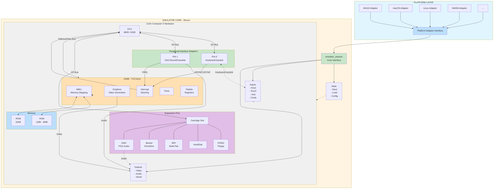
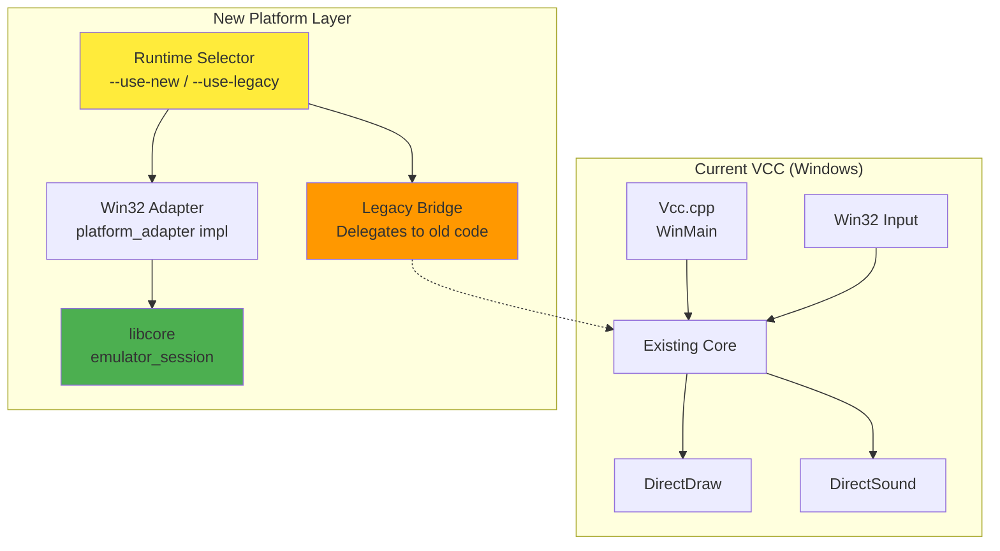
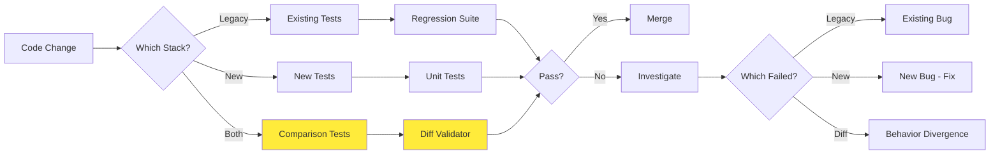

# Cross-Platform Architecture for VCC Emulator

## Overview

This document defines a platform-agnostic interaction boundary for the VCC (Virtual Color Computer) emulator. The goal is to separate the pure emulation logic from any platform-specific concerns, enabling the emulator to run on:

- Desktop (Windows, macOS, Linux)
- Mobile (iOS, Android)
- Web (WASM)
- VR/AR headsets
- Wearables
- Embedded systems
- Cloud/streaming services
- CLI/headless environments

## Core Principle

> **An emulator is fundamentally a state machine with I/O.**

The interaction boundary should reflect this reality, not assume any particular UI paradigm. There are no menus, windows, dialogs, or file paths at the core level.

---

## Architecture Diagram


```mermaid
graph TB
    subgraph Platform["PLATFORM LAYER"]
        Win32[Win32 Adapter]
        macOS[macOS Adapter]
        Linux[Linux Adapter]
        WASM[WASM Adapter]
        Others[...]

        Win32 --> PAI[Platform Adapter Interface]
        macOS --> PAI
        Linux --> PAI
        WASM --> PAI
        Others --> PAI
    end

    subgraph Core["EMULATOR CORE - libcore"]
        PAI --> Session[emulator_session<br/>Core Interface]

        Session --> Inputs[Inputs<br/>- Keys<br/>- Touch<br/>- Axis<br/>- Cmds]
        Session --> Outputs[Outputs<br/>- Video<br/>- Audio<br/>- Serial]
        Session --> State[State<br/>- Save<br/>- Load<br/>- Config]

        subgraph CoCo3["Color Computer 3 Hardware"]
            CPU["CPU<br/>6809 / 6309"]

            subgraph GIME["GIME - TCC1014"]
                MMU[MMU<br/>Memory Mapping]
                Graphics[Graphics<br/>Video Generation]
                IRQSteering[Interrupt<br/>Steering]
                Timer[Timer]
                Palette[Palette<br/>Registers]
            end

            subgraph PIAs["Peripheral Interface Adapters"]
                PIA0["PIA 0<br/>Keyboard/Joystick"]
                PIA1["PIA 1<br/>DAC/Sound/Cassette"]
            end

            subgraph Memory["Memory"]
                RAM["RAM<br/>128K - 8MB"]
                ROM["ROM<br/>32KB"]
            end

            subgraph Expansion["Expansion Port"]
                Cart["Cartridge Slot"]
                FD502["FD502<br/>Floppy"]
                HD["HardDisk"]
                MPI["MPI<br/>Multi-Pak"]
                Becker["Becker<br/>DriveWire"]
                GMC["GMC<br/>PSG Audio"]
            end

            CPU <--> |Address/Data Bus| GIME
            GIME <--> MMU
            MMU <--> RAM
            MMU <--> ROM
            CPU <--> |I/O Bus| PIA0
            CPU <--> |I/O Bus| PIA1
            CPU <--> |I/O Bus| Cart
            Cart --- FD502
            Cart --- HD
            Cart --- MPI
            Cart --- Becker
            Cart --- GMC

            Graphics --> |Video| Outputs
            PIA1 --> |Audio| Outputs
            GMC -.-> |Audio| Outputs
            PIA0 <-.-> |Keyboard/Joystick| Inputs
            IRQSteering --> CPU
            PIA0 --> |HSYNC/VSYNC| IRQSteering
            PIA1 --> |FIRQ| IRQSteering
        end

        Inputs -.-> CoCo3
        State -.-> CoCo3
    end

    style Platform fill:#e1f5ff
    style Core fill:#fff4e1
    style CoCo3 fill:#f0f0f0
    style GIME fill:#ffe0b2
    style PIAs fill:#c8e6c9
    style Memory fill:#bbdefb
    style Expansion fill:#e1bee7
    style Session fill:#c8e6c9
    style PAI fill:#bbdefb
```

---

## Core Types

### Input Events

Input events represent any form of user interaction, abstracted away from the physical input device.

```cpp
namespace vcc::core
{
    /// Abstract input event - no assumption about source
    /// Could originate from keyboard, touch, controller, motion tracking, etc.
    struct input_event
    {
        enum class type : uint8_t
        {
            key_down,       // Discrete key/button press
            key_up,         // Discrete key/button release
            pointer_down,   // Touch/mouse begin
            pointer_up,     // Touch/mouse end
            pointer_move,   // Touch/mouse movement
            axis            // Analog axis (joystick, trigger, accelerometer)
        };

        type event_type;
        uint32_t code;      // Platform-neutral key/button code (see key_codes.h)
        uint8_t pointer_id; // For multi-touch support
        float x;            // Normalized 0.0-1.0 for pointer/axis X
        float y;            // Normalized 0.0-1.0 for pointer/axis Y
        float pressure;     // For pressure-sensitive input (0.0-1.0)
        uint64_t timestamp; // Nanoseconds since session start
    };
}
```

### Commands

Commands represent discrete actions that can be triggered from any source (menu, voice, gesture, CLI, network, automation script, etc.).

```cpp
namespace vcc::core
{
    /// A command parameter value
    using command_param = std::variant<
        std::monostate,             // No value / flag
        bool,                       // Boolean
        int64_t,                    // Integer
        double,                     // Floating point
        std::string,                // Text
        std::vector<uint8_t>        // Binary data
    >;

    /// Commands are discrete actions with optional parameters
    struct command
    {
        std::string name;
        std::map<std::string, command_param> parameters;
    };

    /// Describes an available command (for UI discovery)
    struct command_descriptor
    {
        std::string name;
        std::string description;
        std::string category;       // Grouping hint (not a menu!)

        struct parameter_info
        {
            std::string name;
            std::string description;
            std::string type;       // "bool", "int", "float", "string", "bytes"
            bool required;
            command_param default_value;
        };

        std::vector<parameter_info> parameters;
    };
}
```

### Standard Commands

The emulator core defines these standard commands:

| Command | Parameters | Description |
|---------|------------|-------------|
| `reset` | `type`: "soft" \| "hard" | Reset the machine |
| `pause` | | Pause emulation |
| `resume` | | Resume emulation |
| `insert_media` | `slot`: string, `data`: bytes | Insert disk/cartridge |
| `eject_media` | `slot`: string | Eject media from slot |
| `save_state` | `slot`: int (optional) | Save machine state |
| `load_state` | `slot`: int (optional) | Load machine state |
| `set_speed` | `multiplier`: float | Set emulation speed |
| `configure` | `key`: string, `value`: variant | Change configuration |
| `query` | `property`: string | Query emulator state |

Expansion modules (cartridges/paks) can register additional commands.

---

## Output Types

### Video Output

```cpp
namespace vcc::core
{
    /// Pixel format enumeration
    enum class pixel_format : uint8_t
    {
        rgba8888,       // 32-bit RGBA (most compatible)
        bgra8888,       // 32-bit BGRA (Windows native)
        rgb565,         // 16-bit RGB (mobile-friendly)
        palette8        // 8-bit indexed (with palette)
    };

    /// Video frame output - just raw pixels, no window concepts
    struct video_frame
    {
        std::span<const uint8_t> pixels;    // Raw pixel data
        pixel_format format;
        uint32_t width;                     // Actual pixel width
        uint32_t height;                    // Actual pixel height
        uint32_t stride;                    // Bytes per row (for alignment)
        uint32_t display_aspect_num;        // Display aspect ratio numerator
        uint32_t display_aspect_den;        // Display aspect ratio denominator
        uint64_t frame_number;              // Sequential frame counter

        // Optional palette for indexed modes
        std::span<const uint32_t> palette;  // Up to 256 RGBA entries
    };
}
```

### Audio Output

```cpp
namespace vcc::core
{
    /// Audio buffer output - just samples, no device concepts
    struct audio_buffer
    {
        std::span<const float> samples;     // Interleaved stereo (-1.0 to 1.0)
        uint32_t sample_rate;               // Samples per second
        uint8_t channels;                   // 1 = mono, 2 = stereo
        uint64_t timestamp;                 // Nanoseconds since session start
    };
}
```

---

## Machine Configuration

Configuration uses a flat key-value model with namespaced keys. No file paths - just values.

```cpp
namespace vcc::core
{
    /// Configuration value types
    using config_value = std::variant<
        bool,
        int64_t,
        double,
        std::string,
        std::vector<uint8_t>
    >;

    /// Machine configuration
    struct machine_config
    {
        std::string machine_type;           // "coco3", "coco2", "coco1"
        std::map<std::string, config_value> settings;
    };
}
```

### Standard Configuration Keys

| Key | Type | Description |
|-----|------|-------------|
| `cpu.type` | string | CPU variant ("6809", "6309") |
| `cpu.overclock` | float | Clock multiplier |
| `memory.ram_kb` | int | RAM size in KB |
| `video.monitor_type` | string | "rgb", "composite", "monochrome" |
| `audio.enabled` | bool | Audio output enabled |
| `audio.sample_rate` | int | Preferred sample rate |
| `input.keyboard_layout` | string | Keyboard mapping name |
| `slot.{n}.type` | string | Expansion slot device type |
| `slot.{n}.{setting}` | varies | Slot-specific settings |

---

## Core Session Interface

```cpp
namespace vcc::core
{
    /// Machine state blob for save/load
    using machine_state = std::vector<uint8_t>;

    /// Emulation session result codes
    enum class result : uint8_t
    {
        success,
        invalid_state,
        invalid_command,
        invalid_parameter,
        media_error,
        not_supported
    };

    /// The primary emulator interface
    class emulator_session
    {
    public:
        // =======================================================
        // LIFECYCLE
        // =======================================================

        /// Create a new emulation session with the given configuration
        [[nodiscard]]
        static std::unique_ptr<emulator_session> create(const machine_config& config);

        virtual ~emulator_session() = default;

        // Non-copyable, movable
        emulator_session(const emulator_session&) = delete;
        emulator_session& operator=(const emulator_session&) = delete;
        emulator_session(emulator_session&&) = default;
        emulator_session& operator=(emulator_session&&) = default;

        // =======================================================
        // INPUT
        // =======================================================

        /// Post an input event to the emulator
        virtual void post_input(const input_event& event) = 0;

        /// Execute a command
        [[nodiscard]]
        virtual result execute_command(const command& cmd) = 0;

        // =======================================================
        // EXECUTION
        // =======================================================

        /// Run until the next complete video frame
        virtual void run_frame() = 0;

        /// Run a specific number of CPU cycles (for fine-grained control)
        virtual void run_cycles(size_t count) = 0;

        /// Check if emulation is paused
        [[nodiscard]]
        virtual bool is_paused() const = 0;

        // =======================================================
        // OUTPUT (Pull Model)
        // =======================================================

        /// Get the current video frame
        /// Returns empty span if no new frame is available
        [[nodiscard]]
        virtual video_frame get_video_frame() const = 0;

        /// Get pending audio samples and clear the buffer
        [[nodiscard]]
        virtual audio_buffer consume_audio() = 0;

        /// Check if new video frame is available since last get
        [[nodiscard]]
        virtual bool has_new_frame() const = 0;

        // =======================================================
        // STATE MANAGEMENT
        // =======================================================

        /// Save complete machine state
        [[nodiscard]]
        virtual machine_state save_state() const = 0;

        /// Load complete machine state
        [[nodiscard]]
        virtual result load_state(const machine_state& state) = 0;

        /// Get current configuration
        [[nodiscard]]
        virtual machine_config get_config() const = 0;

        /// Update configuration (may require reset to take effect)
        [[nodiscard]]
        virtual result set_config(const machine_config& config) = 0;

        // =======================================================
        // INTROSPECTION
        // =======================================================

        /// Get all available commands (for UI discovery)
        [[nodiscard]]
        virtual std::vector<command_descriptor> get_available_commands() const = 0;

        /// Get available media slots
        [[nodiscard]]
        virtual std::vector<std::string> get_media_slots() const = 0;

        /// Query if a media slot has media inserted
        [[nodiscard]]
        virtual bool has_media(std::string_view slot) const = 0;

        // =======================================================
        // MEDIA MANAGEMENT
        // =======================================================

        /// Insert media (disk, cartridge, tape) into a slot
        /// Data is the raw media bytes (not a file path!)
        [[nodiscard]]
        virtual result insert_media(
            std::string_view slot,
            std::span<const uint8_t> data,
            std::string_view format_hint = {}) = 0;

        /// Eject media from a slot, returning the (possibly modified) data
        [[nodiscard]]
        virtual std::vector<uint8_t> eject_media(std::string_view slot) = 0;

    protected:
        emulator_session() = default;
    };
}
```

---

## Platform Adapter Interface

Each platform implements this interface to bridge the core emulator to the host environment.

```cpp
namespace vcc::platform
{
    /// Resource location hint (not a file path!)
    struct resource_uri
    {
        std::string scheme;     // "rom", "disk", "state", "config"
        std::string path;       // Logical path within scheme
    };

    /// Platform adapter interface
    class platform_adapter
    {
    public:
        virtual ~platform_adapter() = default;

        // =======================================================
        // RESOURCE MANAGEMENT
        // Platform handles all storage - core never sees file paths
        // =======================================================

        /// Load a resource by URI
        /// Returns empty vector if resource not found
        [[nodiscard]]
        virtual std::vector<uint8_t> load_resource(const resource_uri& uri) = 0;

        /// Save a resource by URI
        [[nodiscard]]
        virtual bool save_resource(
            const resource_uri& uri,
            std::span<const uint8_t> data) = 0;

        /// List available resources of a given type
        [[nodiscard]]
        virtual std::vector<resource_uri> list_resources(std::string_view scheme) = 0;

        // =======================================================
        // OUTPUT PRESENTATION
        // Platform consumes emulator output
        // =======================================================

        /// Present a video frame to the display
        virtual void present_frame(const vcc::core::video_frame& frame) = 0;

        /// Queue audio samples for playback
        virtual void queue_audio(const vcc::core::audio_buffer& buffer) = 0;

        // =======================================================
        // INPUT MAPPING
        // Platform translates native input to abstract events
        // =======================================================

        /// Get the current input mapping configuration
        [[nodiscard]]
        virtual std::map<uint32_t, uint32_t> get_input_mapping() const = 0;

        /// Set input mapping (platform key code -> emulator key code)
        virtual void set_input_mapping(const std::map<uint32_t, uint32_t>& mapping) = 0;

        // =======================================================
        // TIMING
        // =======================================================

        /// Get high-resolution timestamp in nanoseconds
        [[nodiscard]]
        virtual uint64_t get_timestamp_ns() const = 0;

        /// Request callback after specified nanoseconds
        virtual void request_callback(uint64_t delay_ns, std::function<void()> callback) = 0;
    };
}
```

---

## Platform Mapping Examples

### Desktop (Windows/macOS/Linux)

```cpp
class desktop_adapter : public platform_adapter
{
    // Resource loading uses std::filesystem
    // present_frame() blits to window (SDL, GLFW, native)
    // queue_audio() feeds to audio API (WASAPI, CoreAudio, ALSA)
    // Commands come from menu items, keyboard shortcuts
    // File dialogs return bytes, not paths to core
};
```

### Mobile (iOS/Android)

```cpp
class mobile_adapter : public platform_adapter
{
    // Resources from app bundle or documents directory
    // present_frame() renders to Metal/OpenGL view
    // queue_audio() uses AudioQueue/OpenSL
    // Commands from gesture recognizers, on-screen buttons
    // Input events from touch with virtual keyboard overlay
};
```

### Web (WASM)

```cpp
class wasm_adapter : public platform_adapter
{
    // Resources fetched via fetch() API or IndexedDB
    // present_frame() draws to Canvas/WebGL
    // queue_audio() uses Web Audio API
    // Commands from JS interop
    // Input events from DOM events
};
```

### VR (OpenXR)

```cpp
class vr_adapter : public platform_adapter
{
    // Resources from VR runtime storage
    // present_frame() renders to texture in 3D space
    // queue_audio() uses spatial audio API
    // Commands from controller gestures, gaze selection
    // Input from motion controllers, hand tracking
};
```

### CLI/Headless

```cpp
class headless_adapter : public platform_adapter
{
    // Resources from filesystem
    // present_frame() discards or encodes to video file
    // queue_audio() discards or encodes to audio file
    // Commands from stdin or automation script
    // No input events (or scripted input)
};
```

---

## Gentle Migration Strategy

### Core Principle: Parallel Implementation with User Selection

> **Never replace working code - wrap it, delegate to it, or run alongside it.**

The migration uses a **dual-stack architecture** where old and new implementations coexist. Users can freely switch between implementations to troubleshoot issues or compare behavior.


```mermaid
graph TB
    subgraph "Current VCC (Windows)"
        OldMain[Vcc.cpp<br/>WinMain]
        OldVideo[DirectDraw]
        OldAudio[DirectSound]
        OldInput[Win32 Input]
        OldCore[Existing Core]
        
        OldMain --> OldCore
        OldCore --> OldVideo
        OldCore --> OldAudio
        OldInput --> OldCore
    end
    
    subgraph "New Platform Layer"
        Selector[Runtime Selector<br/>--use-new / --use-legacy]
        
        NewAdapter[Win32 Adapter<br/>platform_adapter impl]
        BridgeAdapter[Legacy Bridge<br/>Delegates to old code]
        
        Selector --> NewAdapter
        Selector --> BridgeAdapter
        
        NewAdapter --> LibCore[libcore<br/>emulator_session]
        BridgeAdapter -.-> OldCore
    end
    
    style Selector fill:#ffeb3b
    style BridgeAdapter fill:#ff9800
    style LibCore fill:#4caf50
```

### Migration Phases

Each phase maintains **100% backward compatibility** while incrementally introducing new architecture.

---

## Migration Path

### Phase 1: Define Boundaries & Create Scaffolding

**Goal**: Establish new interfaces without changing existing code.

**Steps**:
1. Create `libcore/` directory with interface headers (no implementation yet)
   - `emulator_session.h`
   - `input_event.h`
   - `video_frame.h`
   - `audio_buffer.h`
   - `machine_config.h`

2. Create `platform-win32/` directory for new Windows adapter
   - Empty implementation stubs
   - No dependencies on existing code yet

3. Create `legacy-bridge/` directory for compatibility layer
   - Implements `emulator_session` interface
   - Delegates all calls to existing `Vcc.cpp` functions
   - Acts as a "facade" over old code

4. Add build configuration flag: `VCC_USE_NEW_CORE`
   - When `OFF`: Build existing code only (default)
   - When `ON`: Build with new interfaces available

**Result**: Project still builds and runs exactly as before. New code exists but isn't used yet.

---

### Phase 2: Implement Legacy Bridge

**Goal**: Make old code accessible through new interfaces without modifying it.

**Example Implementation**:

```cpp
// legacy-bridge/legacy_session.h
namespace vcc::legacy
{
    /// Adapter that makes existing VCC code look like emulator_session
    class legacy_session : public vcc::core::emulator_session
    {
    public:
        static std::unique_ptr<emulator_session> create(const machine_config& config);
        
        void post_input(const input_event& event) override
        {
            // Translate to existing keyboard buffer
            ::KeyboardEvent(translate_key(event.code), event.event_type == input_event::type::key_down);
        }
        
        void run_frame() override
        {
            // Call existing frame execution
            ::vccDoFrame();
        }
        
        video_frame get_video_frame() const override
        {
            // Wrap existing DirectDraw surface
            return wrap_ddraw_surface();
        }
        
        // ... other delegations ...
        
    private:
        uint32_t translate_key(uint32_t new_keycode);
        video_frame wrap_ddraw_surface() const;
    };
}
```

**Steps**:
1. Implement `legacy_session` that wraps all existing global functions
2. Create key code translator (new codes ↔ Windows VK codes)
3. Wrap DirectDraw surfaces as `video_frame`
4. Wrap DirectSound buffers as `audio_buffer`
5. Add runtime selector:

```cpp
// main.cpp addition
std::unique_ptr<emulator_session> create_session(const machine_config& config)
{
    if (use_new_core) {
        return new_core::session::create(config);  // Not implemented yet
    } else {
        return legacy::legacy_session::create(config);  // Works now
    }
}
```

**Result**: Can instantiate `emulator_session` interface that delegates to old code. Nothing functionally changes, but new interface is now testable.

---

### Phase 3: Extract Core Logic Module-by-Module

**Goal**: Implement `libcore` one module at a time, with per-module fallback.

**Priority Order** (from least to most risky):

1. **Configuration System** (no emulation impact)
   - Implement `machine_config` with TOML/JSON serialization
   - Old code still uses INI files
   - Bridge converts between formats

2. **CPU Emulation** (already mostly portable)
   - Port `mc6809.cpp/hd6309.cpp` to `libcore/cpu/`
   - No Windows dependencies to remove
   - Add `--cpu=legacy` or `--cpu=new` flag
   - Run test ROMs on both implementations, compare results

3. **Memory Management** (moderate complexity)
   - Port `tcc1014mmu.cpp` to `libcore/mmu/`
   - Validate against legacy implementation
   - Add memory dump comparison tests

4. **Video Generation** (higher risk - timing sensitive)
   - Port `tcc1014graphics.cpp` to `libcore/video/`
   - Both implementations run in parallel initially
   - Compare pixel outputs frame-by-frame
   - Log mismatches for debugging

5. **Audio Generation** (highest risk - timing critical)
   - Port audio generation to `libcore/audio/`
   - Run both, user can switch with hotkey
   - Visual waveform comparison tool

**Per-Module Runtime Selection**:

```cpp
namespace vcc::core
{
    struct core_components
    {
        enum class cpu_impl { legacy, new_core };
        enum class video_impl { legacy, new_core };
        enum class audio_impl { legacy, new_core };
        // ... etc
        
        cpu_impl cpu = cpu_impl::legacy;  // Default to old
        video_impl video = video_impl::legacy;
        audio_impl audio = audio_impl::legacy;
    };
}
```

**Configuration File Example**:

```toml
# vcc_config.toml
[core.implementation]
cpu = "new"        # Use new CPU implementation
video = "legacy"   # Use old video (debugging new video)
audio = "legacy"   # Use old audio
mmu = "new"        # Use new MMU

[debug]
compare_implementations = true  # Run both, log mismatches
```

**Result**: Gradual replacement of modules. If new video implementation has a bug, switch back to legacy video while debugging, without affecting CPU or audio changes.

---

### Phase 4: Create Platform Adapters (Windows First)

**Goal**: Implement `platform_adapter` for Windows using new interfaces, while old Windows code continues to work.

**Steps**:

1. **Implement `win32_adapter` in `platform-win32/`**
   - Option A: Use SDL2 or GLFW (more portable)
   - Option B: Wrap existing DirectDraw/DirectSound (less risky initially)
   - Resource loading uses existing file paths initially

2. **Create comparison mode**:
   ```cpp
   // Run old and new rendering side-by-side
   if (config.debug.compare_platforms) {
       old_platform->present_frame(frame);  // Original DirectDraw
       new_platform->present_frame(frame);  // SDL2/OpenGL
   }
   ```

3. **Add A/B testing UI**:
   - Menu: "Use New Renderer" (checkbox, runtime toggle)
   - Menu: "Use New Audio System" (checkbox, runtime toggle)
   - Menu: "Compare Implementations" (shows both windows)
   - Hotkey (F12): Instant toggle between implementations

4. **Relocate Windows-specific code gradually**:

| File | Windows Dependency | Migration Target | Bridge Strategy |
|------|-------------------|------------------|-----------------|
| `main.cpp` | `DllMain`, `HINSTANCE` | `platform-win32` | Keep both entry points initially |
| `DialogOps.cpp/h` | Win32 dialogs | `platform-win32` | Commands → dialog shim → old dialogs |
| `dialog_window.cpp/h` | Win32 window/message loop | `platform-win32` | Dual message loop (old & new) |
| `winapi.cpp/h` | Resource loading, string conversion | `platform-win32` | Shared utility during transition |
| `filesystem.cpp` | `CreateFile`, `GetModuleFileName` | `platform-win32` | Old code calls through to new initially |
| `dll_deleter.h` | `FreeLibrary`, `HMODULE` | `platform-win32` | Used by both stacks |

**Result**: Can switch between old and new platform layers at runtime. Both work independently. Performance and correctness can be compared directly.

---

### Phase 5: Validation & Refinement

**Goal**: Ensure new implementations are functionally identical to old ones before removal.

**Validation Techniques**:

1. **Automated Testing**:
   ```bash
   # Run test ROM on both implementations, capture state
   ./vcc --use-legacy --test-rom tests/test.rom --dump-state legacy.state
   ./vcc --use-new --test-rom tests/test.rom --dump-state new.state
   
   # Binary compare machine state
   diff legacy.state new.state
   ```

2. **Frame-by-Frame Video Comparison**:
   ```cpp
   // Record both video outputs
   if (config.debug.record_frames) {
       save_frame("legacy", frame_num, legacy_pixels);
       save_frame("new", frame_num, new_pixels);
       
       // Diff and highlight differences
       auto diff = compare_frames(legacy_pixels, new_pixels);
       if (diff.pixel_differences > threshold) {
           log_warning("Frame {} differs: {} pixels", frame_num, diff.pixel_differences);
       }
   }
   ```

3. **Audio Waveform Analysis**:
   ```cpp
   // Compare audio outputs sample-by-sample
   float correlation = correlate(legacy_audio, new_audio);
   if (correlation < 0.999) {
       log_warning("Audio divergence detected: correlation = {}", correlation);
   }
   ```

4. **Regression Test Suite**:
   - Collect known-good save states from various games
   - Load state → run N frames → compare output
   - Any differences = regression
   - Store as automated CI tests

**Result**: High confidence that new implementation matches old behavior exactly before switching defaults.

---

### Phase 6: Gradual Default Switchover

**Goal**: Make new implementation the default while maintaining easy rollback.

**Timeline** (suggested):

| Milestone | Default | Notes |
|-----------|---------|-------|
| Initial Release | `--use-legacy` | New code exists but not default |
| Beta 1 | `--use-legacy` | Users opt-in with `--use-new` |
| Beta 2 | `--use-new` | Default switches, rollback via `--use-legacy` |
| Beta 3 | `--use-new` | Legacy code still builds, less testing |
| 1.0 | `--use-new` only | Legacy code removed from build |
| 2.0 | New code only | Old code archived in git history |

**Configuration**:
```toml
# vcc_config.toml - User can override defaults
[core]
use_legacy = false  # false = new, true = old

# Per-module granularity
[core.implementation]
cpu = "auto"        # Follow global use_legacy setting
video = "new"       # Force new video even if use_legacy=true
audio = "legacy"    # Force old audio even if use_legacy=false
```

**Command-line Override**:
```bash
# Override config file
./vcc --use-legacy              # Everything uses old code
./vcc --use-new                 # Everything uses new code
./vcc --video=legacy --audio=new  # Mix and match
```

**Result**: Smooth transition where users can opt-in early, and developers can quickly diagnose new issues by switching to legacy code.

---

### Phase 7: Expansion Module Migration

**Goal**: Migrate cartridge/pak modules without breaking existing binary compatibility.

**Challenge**: Current modules are Windows DLLs with a specific C ABI. Need to support both old DLLs and new platform-independent modules simultaneously.

**Dual Module Loading System**:

```cpp
namespace vcc::core
{
    /// Platform-independent module interface
    class expansion_module
    {
    public:
        virtual ~expansion_module() = default;
        
        virtual std::string get_name() const = 0;
        virtual std::string get_version() const = 0;
        
        // Module lifecycle
        virtual void attach(emulator_session& session) = 0;
        virtual void detach() = 0;
        virtual void reset() = 0;
        
        // I/O bus hooks
        virtual uint8_t read(uint16_t address) = 0;
        virtual void write(uint16_t address, uint8_t value) = 0;
        
        // Commands this module provides
        virtual std::vector<command_descriptor> get_commands() const = 0;
        virtual result execute_command(const command& cmd) = 0;
    };
}
```

**Legacy DLL Wrapper**:

```cpp
namespace vcc::legacy
{
    /// Wraps old-style Windows DLL modules as new expansion_module interface
    class legacy_dll_module : public expansion_module
    {
    public:
        explicit legacy_dll_module(const std::filesystem::path& dll_path)
        {
            // Load old DLL
            handle_ = LoadLibraryW(dll_path.c_str());
            
            // Get old-style function pointers
            module_config_ = reinterpret_cast<ModuleConfig*>(
                GetProcAddress(handle_, "ModuleConfig"));
            paksetcartpointer_ = reinterpret_cast<void(*)(MEMREAD, MEMWRITE)>(
                GetProcAddress(handle_, "PakSetCartPointer"));
            // ... other old exports
        }
        
        std::string get_name() const override {
            return module_config_->ModuleName;
        }
        
        uint8_t read(uint16_t address) override {
            // Delegate to old DLL's memory read function
            return old_mem_read_(address);
        }
        
        // ... other delegations
        
    private:
        HMODULE handle_;
        ModuleConfig* module_config_;
        // ... old function pointers
    };
}
```

**Module Registry with Fallback**:

```cpp
// Module loading priority:
// 1. Check for new-style .so/.dylib/.dll (platform-independent ABI)
// 2. Fall back to legacy Windows DLL (Windows only)
// 3. Report error if neither found

auto module = module_loader::load("FD502");
// Looks for:
//   - modules/FD502.module.dll (new style)
//   - modules/FD502.dll (legacy style)
```

**Migration Strategy for Each Cartridge**:

| Module | Priority | Strategy |
|--------|----------|----------|
| FD502 | High | Migrate early, keep legacy DLL for comparison |
| Becker | High | Already mostly portable, easy migration |
| HardDisk | Medium | Migrate, validate against legacy with test images |
| GMC | Medium | Audio-sensitive, extensive testing needed |
| MPI | Low | Complex, migrate late |
| Orch90 | Low | Audio-critical, migrate late with care |
| SuperIDE | Low | Specialized, migrate last |

**Dual-Module Testing**:

```toml
[cartridge.fd502]
implementation = "auto"  # Try new first, fall back to legacy
# or
implementation = "new"   # Force new implementation
# or
implementation = "legacy"  # Force legacy DLL

[debug]
compare_cartridge_io = true  # Log when old and new modules diverge
```

**Result**: Old cartridge DLLs continue to work indefinitely. New modules are developed and tested alongside old ones. Users can mix legacy and new modules freely.

---

### Phase 8: Additional Platforms

**Goal**: Once core and Windows adapter are stable, expand to other platforms.

With clean separation, adding new platforms becomes straightforward:

**macOS / Linux (SDL2)**:
```bash
# Same libcore, different platform adapter
cmake -DPLATFORM=SDL2 .
make
```
- Implement `sdl2_adapter` using SDL2 for video/audio/input
- Resource loading from bundle (macOS) or XDG directories (Linux)
- No legacy bridge needed (starting fresh)

**Web (WASM)**:
```bash
# Compile to WebAssembly
emcc -o vcc.js -s WASM=1 ...
```
- `wasm_adapter` using Canvas/WebGL + Web Audio
- ROMs embedded in WASM bundle or fetched via HTTP
- Save states to IndexedDB

**Mobile (iOS/Android)**:
- `ios_adapter` / `android_adapter`
- Touch input with virtual keyboard
- Files from app sandbox
- Cloud save sync

**No legacy code needed on new platforms** - they start with clean implementation only.

---

## Key Design Decisions

### No File Paths in Core

**Rationale**: File paths are platform-specific (path separators, encoding, access permissions). The core deals only with byte streams.

```cpp
// ? Wrong - platform specific
void load_disk(const char* path);

// ? Correct - platform agnostic
result insert_media(std::string_view slot, std::span<const uint8_t> data);
```

### Pull-Based Output

**Rationale**: The platform controls timing (vsync, audio buffering, network latency). Push-based output assumes synchronous rendering which doesn't work everywhere.

```cpp
// ? Wrong - assumes platform is always ready
void on_frame_complete(callback);

// ? Correct - platform pulls when ready
video_frame get_video_frame() const;
```

### Commands Over Methods

**Rationale**: A fixed API can't anticipate all actions (especially from expansion modules). Commands are discoverable and extensible.

```cpp
// ? Wrong - rigid API
void insert_disk(int drive, const disk_image& disk);
void set_cpu_speed(float multiplier);
void enable_fdc_logging(bool enable);

// ? Correct - flexible and discoverable
result execute_command(const command& cmd);
std::vector<command_descriptor> get_available_commands() const;
```

### No Threading Assumptions

**Rationale**: Threading models vary wildly across platforms. Some (WASM) are single-threaded. The core is single-threaded; platform manages threading.

```cpp
// ? Wrong - assumes threading
void start_emulation_thread();
std::mutex& get_frame_lock();

// ? Correct - synchronous, platform manages threads
void run_frame();
void run_cycles(size_t count);
```

---

## Latency Considerations

For games and interactive software, latency is critical to user experience. The architecture must minimize end-to-end latency in both input and audio paths.

> **Audio quality is paramount.** Users notice audio glitches (pops, clicks, dropouts) immediately, while dropped video frames often go unnoticed. When resources are constrained, always prioritize audio stability over video smoothness. A solid 30fps with perfect audio is far better than stuttery 60fps with audio artifacts.

### Input Latency Budget

| Stage | Target | Notes |
|-------|--------|-------|
| Platform input capture | < 1ms | OS-level event handling |
| Input → emulator core | < 1ms | Event queue processing |
| Emulator processing | ~16ms | One frame at 60fps |
| Video render + display | 8-16ms | Depends on vsync, display |
| **Total input-to-photon** | **< 50ms** | Perceptible threshold ~100ms |

**Recommendations:**
- Process input events at the start of each frame, not queued for next frame
- Provide `run_cycles()` for sub-frame input processing when needed
- Platform adapters should use low-latency input APIs (raw input, polling)

### Audio Latency Budget

| Stage | Target | Notes |
|-------|--------|-------|
| Audio generation | Per-scanline | ~63µs per line, ~16ms per frame |
| Core → platform buffer | < 5ms | Pull-based audio consumption |
| Platform audio buffer | 10-40ms | OS/driver dependent |
| DAC + speaker | < 5ms | Hardware dependent |
| **Total audio latency** | **< 50ms** | Musical timing threshold ~20ms |

**Recommendations:**
- Generate audio in small chunks (per-scanline or per-N-cycles), not per-frame
- Platform adapters should use low-latency audio APIs:
  - Windows: WASAPI exclusive mode (~10ms achievable)
  - macOS: Core Audio (~10ms achievable)
  - Linux: JACK or PipeWire low-latency mode
  - Web: AudioWorklet with small buffer sizes
- Provide configurable buffer sizes (latency vs. stability tradeoff)

### Audio Buffer Strategy

```cpp
/// Audio is generated incrementally, not in frame-sized chunks
struct audio_config
{
    uint32_t sample_rate;       // 44100 or 48000 Hz
    uint32_t buffer_frames;     // Samples per buffer (256-2048 typical)
    uint32_t num_buffers;       // Ring buffer count (2-4 typical)
};

// Platform requests specific amount of audio
// Core generates exactly what's needed for cycle-accurate sync
audio_buffer consume_audio(size_t max_samples);
```

### Latency vs. Stability Tradeoff

| Buffer Size | Latency | Stability |
|-------------|---------|-----------|
| 128 samples (~3ms) | Excellent | May glitch on slow systems |
| 256 samples (~6ms) | Very good | Stable on most systems |
| 512 samples (~11ms) | Good | Very stable |
| 1024 samples (~23ms) | Noticeable | Rock solid |

Default to 256-512 samples; let users adjust based on their hardware.

---

## Risk Mitigation with Dual-Stack Approach

### Benefits of Parallel Implementation

| Risk | Traditional Rewrite | Dual-Stack Approach |
|------|---------------------|---------------------|
| **Regression** | Breaks existing features | Users can switch back to old code |
| **Development Time** | Project blocked until complete | Incremental delivery, always shippable |
| **Testing Burden** | Must test everything at once | Test each module independently |
| **User Disruption** | Big bang migration | Gradual opt-in, smooth transition |
| **Debugging Difficulty** | No reference implementation | Users can compare old vs new behavior |
| **Community Feedback** | Can't get feedback until done | Early adopters test and report issues |
| **Abandonment Risk** | If stalled, nothing to show | Partial work is still valuable |

### Concrete Examples

**Scenario 1: Video Regression**
```
User reports: "Graphics corrupted in Dungeons of Daggorath with new renderer"

Traditional approach:
- Bisect commits to find regression
- Hard to reproduce without game context
- May take days/weeks to fix

Dual-stack approach:
User runs: ./vcc --video=legacy  # Verify it's a new renderer issue
# If legacy works, confirms problem is in new video code
# User can continue using legacy while developers fix
# Fix: Only affects new code, no risk to legacy users
```

**Scenario 2: Audio Timing Issue**
```
User: "Slight crackling in GMC music, didn't happen in previous version"

Traditional approach:
- Entire project blocked on audio fix
- Pressure to ship with workaround

Dual-stack approach:
User tests: ./vcc --audio=legacy --video=new --cpu=new
# If crackling stops, confirms it's audio implementation issue
# User continues with legacy audio while using new video/CPU
# Developers fix audio without blocking other improvements
```

**Scenario 3: Subtle Behavior Difference**
```
User: "Game runs differently, not sure which component is causing it"

Traditional approach:
- Hard to isolate which change caused issue
- May revert entire update

Dual-stack approach:
User systematically tests combinations:
./vcc --cpu=legacy --video=new --audio=new  # Still different?
./vcc --cpu=new --video=legacy --audio=new  # Still different?
./vcc --cpu=new --video=new --audio=legacy  # Still different?
# Isolates which component changed behavior
# Reports findings to developers with specific component identified
```

### Continuous Validation Strategy


```mermaid
graph LR
    A[Code Change] --> B{Which Stack?}
    B -->|Legacy| C[Existing Tests]
    B -->|New| D[New Tests]
    B -->|Both| E[Comparison Tests]
    
    C --> F[Regression Suite]
    D --> G[Unit Tests]
    E --> H[Diff Validator]
    
    F --> I{Pass?}
    G --> I
    H --> I
    
    I -->|Yes| J[Merge]
    I -->|No| K[Investigate]
    
    K --> L{Which Failed?}
    L -->|Legacy| M[Existing Bug]
    L -->|New| N[New Bug - Fix]
    L -->|Diff| O[Behavior Divergence]
    
    style E fill:#ffeb3b
    style H fill:#ffeb3b
```

### User Control & Troubleshooting

At any point during migration, users have multiple options:

1. **Full Legacy Mode**: `--use-legacy` uses all old code
2. **Full New Mode**: `--use-new` uses all new code (when available)
3. **Hybrid Mode**: Mix and match per component:
   - `--cpu=legacy --video=new`
   - `--audio=legacy --cpu=new --video=new`
   - Any combination to isolate issues
4. **Configuration Persistence**: Settings saved in `vcc_config.toml`
5. **Developer Rollback**: Old code remains in tree, easily revertible via build flags

Users experiencing issues can systematically test different combinations to identify which component is causing the problem, then report specific findings to developers.

This makes the migration **low-risk** and **user-controlled** at every step.

---

## Open Questions

1. **Debugger Integration**: Should debugging (breakpoints, memory inspection) be part of `emulator_session` or a separate interface?
   - Proposal: Separate `debug_interface` that can attach to either legacy or new core
   - Commands like `set_breakpoint`, `step_instruction`, `inspect_memory`
   - Works with both old and new implementations during transition

2. **Network Play**: How do we handle networked multiplayer (DriveWire, multiplayer games)?
   - Needs deterministic emulation (fixed frame timing)
   - State synchronization between instances
   - Input prediction and rollback for low latency

3. **Hot Reload**: Can we support swapping expansion modules without full reset?
   - Current modules maintain state in globals
   - New modules would need explicit state save/restore
   - Useful for development and testing

4. **Accessibility**: How do we expose emulator state for screen readers, alternative input methods?
   - Commands could be triggered by voice, eye tracking, etc.
   - OCR on video output for screen readers
   - Haptic feedback for audio cues

5. **Module Compatibility**: How long should we maintain legacy DLL loading?
   - Until all core modules (FD502, Becker, etc.) are ported?
   - Indefinitely for third-party modules?
   - Provide conversion guide for third-party developers?

6. **Performance Validation**: How do we ensure new implementation doesn't regress performance?
   - Automated benchmarks comparing old vs. new
   - Frame time histograms
   - CPU usage monitoring

7. **Configuration Migration**: How do users transition settings from old to new?
   - Auto-import from old INI files?
   - Side-by-side: old config continues to work, new config preferred
   - Migration tool to convert configs?

---

## Next Steps

### Immediate (Phase 1)
- [ ] Review and finalize interface definitions in this document
- [ ] Get stakeholder buy-in on dual-stack migration approach
- [ ] Create `libcore/` project with header-only interfaces
- [ ] Create `legacy-bridge/` project structure
- [ ] Create `platform-win32/` project structure
- [ ] Add `VCC_USE_NEW_CORE` build flag (defaults to OFF)
- [ ] Ensure project still builds with flag OFF (no changes to existing code)

### Short-term (Phase 2)
- [ ] Define platform-neutral key code enumeration
- [ ] Implement `machine_config` with TOML/JSON serialization
- [ ] Implement `legacy_session` wrapping existing `Vcc.cpp` entry points
- [ ] Create runtime selector: `--use-legacy` vs. `--use-new` flags
- [ ] Add configuration file support: `vcc_config.toml`
- [ ] Build and test: new code wraps old code, behavior identical

### Medium-term (Phase 3-4)
- [ ] Port CPU emulation to `libcore/cpu/`
- [ ] Add per-module selection (CPU, video, audio, MMU)
- [ ] Implement comparison mode (run both, diff outputs)
- [ ] Port memory management to `libcore/mmu/`
- [ ] Prototype `win32_adapter` with SDL2 or DirectX wrapper
- [ ] Create frame-by-frame video comparison tool
- [ ] Create audio waveform analysis tool

### Long-term (Phase 5-8)
- [ ] Port video generation to `libcore/video/`
- [ ] Port audio generation to `libcore/audio/`
- [ ] Extensive regression testing and validation
- [ ] Switch default to new implementation (with easy rollback)
- [ ] Port expansion modules (FD502, Becker, etc.)
- [ ] Implement platform-independent module loading
- [ ] Create macOS/Linux ports (SDL2 adapter)
- [ ] Create web port (WASM adapter)

### Future
- [ ] Remove legacy code from main branch (archive in git)
- [ ] Publish cross-platform builds
- [ ] Third-party module developer guide
- [ ] Mobile ports (iOS/Android)
